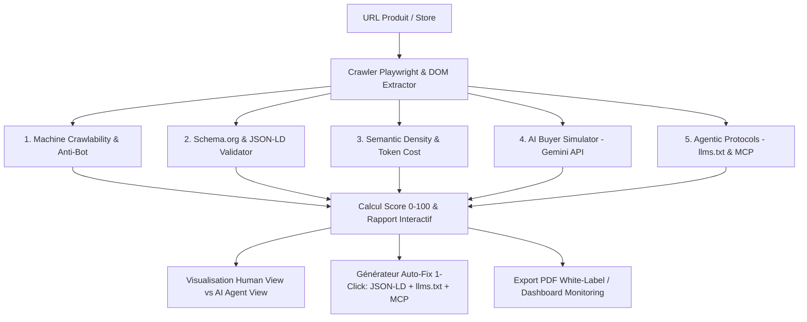

# 📋 Product Requirements Document (PRD)

## 📌 Informations Générales
- **Nom du Produit :** `AgentReady` (ou `AIReady Commerce`)
- **Version :** v1.0 (MVP)
- **Auteur :** Équipe Produit & Stratégie
- **Date :** Septembre 2026
- **Statut :** Approuvé pour développement

---

## 1. Vision & Objectifs (OKRs)

### 🌟 Vision Produit
> **Devenir la suite logicielle de référence pour auditer, simuler et optimiser la visibilité et la transactabilité des sites e-commerce auprès des agents IA autonomes.**

### 🎯 Objectifs Stratégiques (Q1-Q2)
1. **Acquisition & Notoriété :** Dépasser **10 000 scans d'URL** dans les 60 jours suivant le lancement public.
2. **Conversion Lead $\rightarrow$ Sign-up :** Atteindre un taux de conversion de **12%** du scanner gratuit vers la création de compte.
3. **Monétisation :** Atteindre **25 000 $ de MRR** sous 4 mois (mix marchands Pro à 49$/m et agences à 199$/m).

---

## 2. Parcours Utilisateur & Architecture Fonctionnelle



---

## 3. Spécification Détaillée des 5 Piliers d'Audit (Score 0 à 100)

| Pilier | Poids | Règles & Vérifications Techniques | Critères de Succès |
| :--- | :---: | :--- | :--- |
| **1. Crawlability & Bot Access** | **20%** | • Analyse de `robots.txt` (`GPTBot`, `ClaudeBot`, `PerplexityBot`, `Google-Extended`).<br/>• Détection des barrières WAF (Cloudflare Challenge, DataDome).<br/>• Détection du rendu (SSR vs CSR avec blocage JS). | Bots autorisés, aucun challenge bloquant, HTML pré-rendu en SSR. |
| **2. Schema.org & JSON-LD** | **25%** | • Schéma `@type: "Product"` et `Offer`.<br/>• Attributs obligatoires : `name`, `description`, `sku`, `gtin`, `price`, `priceCurrency`, `availability`.<br/>• Attributs avancés : `hasMerchantReturnPolicy`, `shippingDetails`, gestion des variantes. | Schéma 100% conforme sans warnings Schema.org ni champs critiques manquants. |
| **3. Pureté Sémantique & Tokens** | **20%** | • Ratio texte produit utile / pollution DOM (scripts, trackers, SVG masqués).<br/>• Balisage HTML5 sémantique (`<main>`, `<article>`, `<table>` de specs).<br/>• Estimation du coût en tokens par requête d'IA. | Rendu markdown épuré, moins de 1 500 tokens par fiche produit. |
| **4. AI Buyer Simulator** | **20%** | • Évaluation en direct via l'API Gemini de 5 questions d'achat type :<br/>  1. Prix et frais de livraison exacts.<br/>  2. Disponibilité en stock et dimensions.<br/>  3. Politique de retour et garantie.<br/>  4. Avantages vs concurrence.<br/>  5. Compatibilité technique.<br/>• Évaluation de l'indice d'hallucination (Faible/Moyen/Élevé). | Réponse exacte et sans ambiguïté sur les 5 questions, 0 hallucination. |
| **5. Protocoles Agentiques (MCP/llms.txt)** | **15%** | • Présence de `/.well-known/llms.txt` ou `/llms.txt`.<br/>• Présence d'un manifeste `agent-card.json`.<br/>• Endpoint public de disponibilité de panier/stock (MCP). | `llms.txt` valide et endpoint MCP fonctionnel. |

---

## 4. Modules Fonctionnels du Produit

### Module A : Le Scanner Gratuit & Lead Magnet
- **Champ de saisie d'URL :** Validation instantanée de domaine ou fiche produit.
- **Jauge de Score Circulaire (0-100) :**
  - 🔴 `0 - 49` : **Agent Blind** (Inaudible et invisible pour l'IA).
  - 🟡 `50 - 79` : **Agent Friction** (L'IA extrait des données partielles ou risque d'halluciner).
  - 🟢 `80 - 100` : **Agent Ready** (Parfaitement optimisé pour l'achat autonome).
- **Comparateur Split-Screen :**
  - *Gauche :* Vue Humaine (Capture d'écran de la boutique).
  - *Droite :* Vue Agent IA (Rendu brut textuel, détection des données illisibles).
- **Capture de Lead :** Saisie email pour débloquer l'export PDF complet et les recommandations correctives.

### Module B : Le Moteur d'Auto-Fix & Protocol Generator
- **Générateur `llms.txt` & `llms-full.txt` :** Fichier structuré optimisé décrivant l'ensemble de l'offre et des politiques du marchand.
- **Générateur de Snippet JSON-LD Enrichi :** Code copiable en 1 clic ou injecté automatiquement.
- **Serveur MCP Auto-généré :** Export d'une configuration de serveur Model Context Protocol permettant à Claude ou ChatGPT d'interroger directement l'inventaire.

### Module C : Espace Agence & Rapports Marque Blanche
- Génération de rapports PDF de 5 pages personnalisés avec le logo et les couleurs de l'agence.
- Scan en lot (Batch Scan) jusqu'à 500 URLs avec export CSV/Excel.
- Gestion multi-clients et invitations d'équipe.

---

## 5. Spécifications Techniques & Architecture

```
[ FRONTEND ] Next.js 15 + Tailwind CSS + Lucide Icons + Framer Motion
      │
      ▼ (API REST / WebSocket)
[ BACKEND API ] FastAPI (Python) ou Node.js (Fastify)
      ├── Scraper / Headless Browser : Playwright
      ├── Parser Sémantique : Cheerio + Extrateur Schema.org (ext-jsonld)
      ├── Moteur d'Évaluation IA : Google Gemini API (Structured Outputs)
      ├── Base de Données : PostgreSQL (Prisma/Drizzle) + Redis (Queue BullMQ)
      └── Storage : Supabase / S3 (Screenshots & Rapports PDF)
```

---

## 6. Modèle Économique & Grille Tarifaire

| Fonctionnalité | Free Tier (0 €/m) | Pro Merchant (49 €/m) | Agency / Scale (199 €/m) |
| :--- | :---: | :---: | :---: |
| **Scans d'URL** | 3 / jour | 250 produits / mois | 2 500 produits / mois |
| **Score global & 5 piliers** | ✅ Inclus | ✅ Inclus | ✅ Inclus |
| **AI Buyer Simulator (Gemini)** | 1 test démo | 50 tests / mois | 500 tests / mois |
| **Générateur llms.txt & JSON-LD** | Aperçu basique | ✅ Export complet illimité | ✅ Export complet illimité |
| **Serveur MCP Dédié** | ❌ | ✅ Inclus | ✅ Inclus |
| **Rapports PDF White-Label** | ❌ | ❌ | ✅ Logo & Marque personnalisée |
| **Scans en Masse (Batch)** | ❌ | ❌ | ✅ Jusqu'à 500 URLs / batch |
| **Support** | Communautaire | Email prioritaire | Dédié & Slack partagé |

---

## 7. Roadmap d'Implémentation (Phasage MVP)

### Phase 1 : Core MVP (Semaines 1 - 2)
- [x] Spécifications techniques & PRD.
- [ ] Moteur d'audit backend (Playwright crawler + Schema Parser + test robots.txt).
- [ ] Intégration Gemini API pour l'AI Buyer Simulator.
- [ ] Landing page & Scanner interactif avec jauge de score et split-screen "Human vs AI View".

### Phase 2 : Auto-Fix & Monétisation (Semaines 3 - 4)
- [ ] Générateur de `llms.txt` et microdonnées JSON-LD.
- [ ] Générateur de configuration de serveur MCP.
- [ ] Intégration Stripe (Abonnements Pro & Agency) et système d'authentification.
- [ ] Générateur de rapports PDF téléchargeables.

### Phase 3 : Plugins & Scale (Mois 2)
- [ ] Application Shopify officielle.
- [ ] Module de scan en masse pour agences (Batch Scan).
- [ ] Dashboard de monitoring récurrent de visibilité IA.
